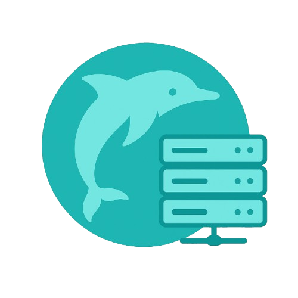

## DNS Dolphine

This is local a Domain name server which maps url to their crossponding ip addresses.

## Overview

This project runs two servers in one Node.js process:

- An Express HTTP API for managing DNS‑to‑port mappings (CRUD).

- A UDP DNS resolver that returns 127.0.0.1 for A‑queries matching those mappings.

For full DNS theory and architecture, see [theory.md](/assets/Theory.md).
