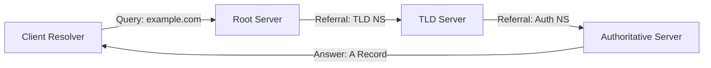
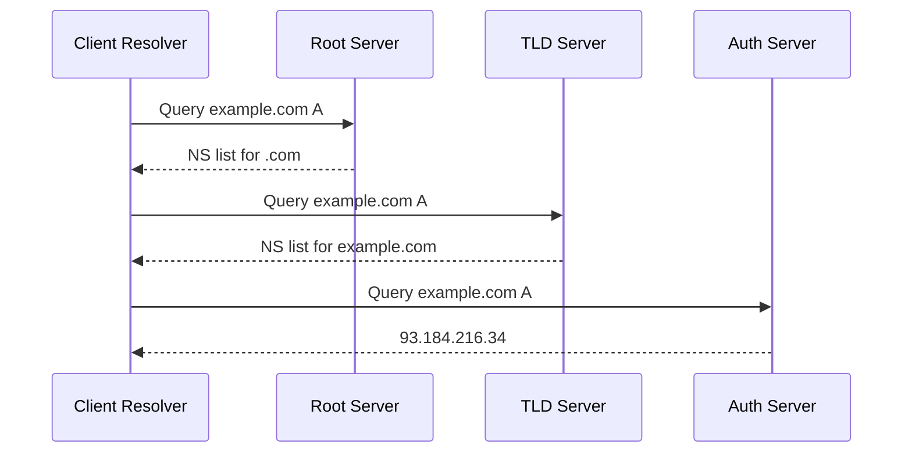
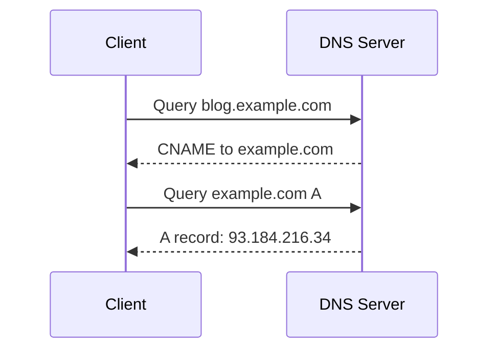

## What is DNS ⚙️

The Domain Name System (DNS) is a hierarchical, distributed naming system that translates human-friendly domain names (like `example.com`) into IP addresses (like `93.184.216.34`), enabling browsers and network clients to locate and communicate with servers.

---

## How it works globally 🌐

Globally, DNS resolution follows a three-step iterative process. Although there are 13 _logical_ root servers (identified at [root-servers.org](https://root-servers.org/)), the anycast network behind them provides hundreds of physical instances worldwide.

### Step 1: Query the Root 🥇

- **Resolver**: Your stub resolver sends a DNS query to a root server.
- **Root Server**: Does not know the final record, but refers you to the TLD(Top Level Domain) name servers (e.g., for `.com`, `.org`, `.dev`).
- **Response**: IP addresses of the TLD servers for that TLD.

### Step 2: Query the TLD Server 🥈

- **Resolver**: Queries one of the TLD servers from Step 1.
- **TLD Server**: Refers you to the authoritative name servers for the specific domain (e.g., `first.localhost`).
- **Response**: IP addresses of the authoritative name servers.

### Step 3: Query the Authoritative Server 🥉

- **Resolver**: Queries the authoritative server for the desired record type (A, CNAME, etc.).
- **Authoritative Server**: Returns the requested record (e.g., the A record with the IP address).
- **Caching**: Resolver caches the response according to the record's TTL before returning it to the client.

### Visualization: DNS Lookup Flowchart



### Detailed Sequence Diagram



---

## Different types of DNS Records 📋

DNS supports various record types; here are some of the most common:

| Record Type | Purpose                                                             |
| ----------- | ------------------------------------------------------------------- |
| **A**       | Maps a domain name to an IPv4 address.                              |
| **AAAA**    | Maps a domain name to an IPv6 address.                              |
| **CNAME**   | Defines an alias from one domain name to another canonical name.    |
| **NS**      | Delegates a zone to a set of authoritative name servers.            |
| **MX**      | Specifies mail exchange servers for a domain (email routing).       |
| **TXT**     | Carries arbitrary text data (often for SPF, DKIM, or verification). |

### A Record 🔗

Directly maps a hostname to its IPv4 address:

```dns
example.com. 3600 IN A 93.184.216.34
```

### CNAME Record 🔄

Creates an alias to another domain name. For example, to point `blog.example.com` at `example.com`:

```dns
blog.example.com. 3600 IN CNAME example.com.
```

**Resolution Flow:**



### NS Record 🗂️

Delegates a domain (or subdomain) to specific authoritative servers:

```dns
example.com.  86400 IN NS ns1.hosting.com.
example.com.  86400 IN NS ns2.hosting.com.
```

**Usage:**

- NS records tell resolvers which servers to ask for records in that zone.
- Unlike CNAME, NS delegates responsibility rather than aliasing a name.

---

## Working of a DNS Server 🖥️

- **Protocol**: Primarily uses UDP on port 53 (fast, connectionless).
- **TCP Port 53**: Used for zone transfers (AXFR/IXFR) and when responses exceed UDP size limits.

```ascii
     +----------------+      UDP:53       +-----------+
     | Client Resolver|------------------>| DNS Server|
     +----------------+                   +-----------+
```

---

## Checking with `dig` 🕵️‍♂️

To inspect DNS records:

```sh
dig @<dns-server> <domain> <record-type>
# e.g., dig @8.8.8.8 example.com A
```
